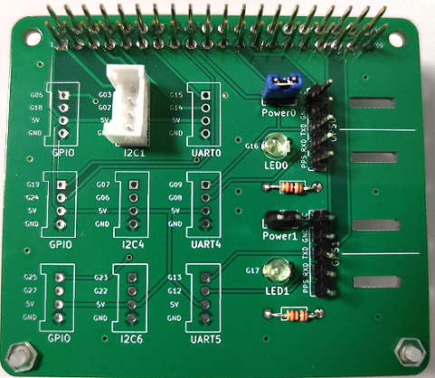
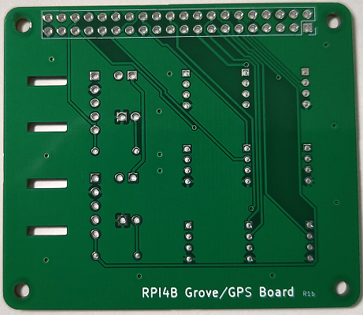

# NTPサーバーの構築

## きっかけ
次のホームページをみたことです。
その1～その6まであって、読み物としてもおもしろいです。楽しく読ませていただきました。ありがとうございました。
- [GPSを使ったNTPサーバの構築 その1](https://qiita.com/R800/items/79973eb327af3c8cf7e8)
- [GPSを使ったNTPサーバの構築 その6 まとめ](https://qiita.com/R800/items/6a04548beba9668b271d)

## できたもの
RPI4+GPS+RTCで**NTPサーバー**ができました。

## さぎょう

### 部品
- Raspberry Pi 4 Model B
- [ＧＰＳ受信機　シリアル出力タイプ（先バラ）　みちびき２機（１９４／１９５）対応　１ＰＰＳ出力付　ＧＴ－５０２ＭＧＧ－Ｎ](https://akizukidenshi.com/catalog/g/gM-17980/)
- [GROVE - RTC](https://www.switch-science.com/products/826)

### 作業
1. PRI4にUbuntu Serverのインストール、設定
    1. Ubuntu Server 64bitをRaspberry Pi ImagerでSDへ書き込む。
        ```
        ubuntu-22.04.3-preinstalled-server-arm64+raspi.img.xz
        ```    
        今回は無線LAN＆固定IPで使用するためにSD内の network-config へ設定追加。
        ```
        version: 2
        wifis:
            renderer: networkd
            wlan0:
                addresses:
                    - 192.168.24X.2XX/24
                gateway4: 192.168.24X.1
                nameservers:
                    addresses: [192.168.24X.1]
                optional: true
                access-points:
                    "kokoha-ssid":
                        password: "XXXXXX・・・・・・・・・・・・"
        ```
        SDでPRI4を起動。そして更新。
        ```
        sudo apt update
        sudo apt upgrade
        ```
    1. インストール直後のシリアルを確認(変更前)
        ```
        ls -la /dev/serial*
        
        lrwxrwxrwx 1 root root 5 Aug  8 00:34 /dev/serial0 -> ttyS0
        lrwxrwxrwx 1 root root 7 Aug  8 00:34 /dev/serial1 -> ttyAMA0
        ```
    1. シリアルポートの追加
        ```
        sudo vi /boot/firmware/config.txt
        
        dtoverlay=uart4
        dtoverlay=uart5
        ```
    1. pps信号をGPIO18ピンで受信できるように変更
        ```
        sudo vi /boot/firmware/config.txt
        
        dtoverlay=pps-gpio,gpiopin=16
        ```
    1. ntpdでgpsを読み取れるように、デバイスを用意
        ```
        sudo vi /etc/udev/rules.d/10-gps.rules
        
        KERNEL=="ttyAMA1",MODE="0666",SYMLINK+="gps0"
        KERNEL=="pps0",OWNER="root",GROUP="dialout",MODE="0666",SYMLINK+="gpspps0"
        ```
    1. デバイスの確認
        ```
        sudo ls -la /dev/serial* /dev/ttyAMA* /dev/gps* /dev/pps* /dev/gpspps*
        
        lrwxrwxrwx 1 root root          7 Aug  8 00:34 /dev/gps0 -> ttyAMA1
        lrwxrwxrwx 1 root root          4 Aug  8 00:34 /dev/gpspps0 -> pps0
        lrwxrwxrwx 1 root root          4 Aug  8 00:34 /dev/gpspps0 -> pps0
        crw-rw-rw- 1 root dialout 246,  0 Aug  8 00:34 /dev/pps0
        lrwxrwxrwx 1 root root          5 Aug  8 00:34 /dev/serial0 -> ttyS0
        lrwxrwxrwx 1 root root          7 Aug  8 00:34 /dev/serial1 -> ttyAMA0
        crw-rw---- 1 root dialout 204, 64 Aug 26 17:45 /dev/ttyAMA0
        crw-rw-rw- 1 root dialout 204, 65 Aug  8 00:34 /dev/ttyAMA1
        crw-rw-rw- 1 root dialout 204, 66 Aug  8 00:34 /dev/ttyAMA2
        ```

1. GPS受信機の接続、設定
    1. RPI4へGPS受信機を接続
        | RPI4 | GPS受信機 |
        | -- | -- |
        | 5V : PIN4 | VCC |
        | GND : PIN6 | GND |
        | TXD4 : PIN24 | RXD |
        | RXD4 : PIN21 | TXD |
        | GPIO16 : PIN36 | PPS |
    1. gpsデータの受信状況を確認(約1秒ごとにデータが受信できていれば良い)
        ```
        sudo cat /dev/ttyAMA1
        
        $GLGSV,3,3,10,83,11,293,,88,11,088,*67
        $GAGSV,2,1,08,15,62,026,24,27,44,228,34,13,44,287,,21,34,299,*62
        ```
    1. pps信号の受信状況を確認
        ```
        sudo apt install pps-tools
        ```
        ```
        sudo ppstest /dev/pps0
        
        trying PPS source "/dev/pps0"
        found PPS source "/dev/pps0"
        ok, found 1 source(s), now start fetching data...
        source 0 - assert 1693040467.850781841, sequence: 80 - clear  0.000000000, sequence: 0
        source 0 - assert 1693040468.853499776, sequence: 81 - clear  0.000000000, sequence: 0
        source 0 - assert 1693040469.856065846, sequence: 82 - clear  0.000000000, sequence: 0
        ```
    1. gps受信機が送信するデータを限定
        
        dotnetアプリを作った
        ```
        SetGpsParam.csproj
        
        <Project Sdk="Microsoft.NET.Sdk">

          <PropertyGroup>
            <OutputType>Exe</OutputType>
            <TargetFramework>net6.0</TargetFramework>
            <ImplicitUsings>enable</ImplicitUsings>
            <Nullable>enable</Nullable>
          </PropertyGroup>

          <ItemGroup>
            <PackageReference Include="Iot.Device.Bindings" Version="3.0.0" />
          </ItemGroup>

        </Project>
        ```
        ```
        Program.cs

        using System.IO.Ports;
        using System.Text;
        using Iot.Device.MT3333;

        string VersionValue = "0.1.0-bata";

        //string CommandGetQRelease = "$PMTK605*31\r\n";
        string CommandSetGnssSearchMode = "$PMTK353,1,0,1,0,0*2B\r\n";
        string CommandSetSupportQzss    = "$PMTK351,1*28\r\n";
        string CommandSetNmeaOutput     = "$PMTK314,0,1,0,1,0,0,0,0,0,0,0,0,0,0,0,0,0,0,0*28\r\n";
        //string CommandSetNmeaBaudrate   = "$PMTK251,9600*17\r\n";

        // string[] args
        if (args.Length == 0)
        {
            Console.WriteLine("Please enter a string argument.");
            Console.WriteLine("Usage: SetGpsParam /dev/ttyAMA<num>");
            Console.WriteLine("Usage: SetGpsParam --version, -V");
            return;
        }

        string args0Value = args[0];
        if (args0Value == "--version" || args0Value == "-V")
        {
            Console.WriteLine("Version: {0}", VersionValue);
            return;
        }

        using SerialPort serialPort = new SerialPort(args0Value, 9600, Parity.None, 8, StopBits.One)
        {
            Encoding = Encoding.ASCII,
            ReadTimeout = 1000,
            WriteTimeout = 1000
        };

        try
        {
            serialPort.Open();
            using MT3333 gps = new(serialPort.BaseStream, true);

            Thread.Sleep(1000);

            gps.SendRequest(CommandSetGnssSearchMode);
            Console.WriteLine("Command:SetGnssSearchMode");
            Thread.Sleep(1000);
            gps.SendRequest(CommandSetSupportQzss);
            Console.WriteLine("Command:SetSupportQzss");
            Thread.Sleep(1000);
            gps.SendRequest(CommandSetNmeaOutput);
            Console.WriteLine("Command:SetNmeaOutput");
            Thread.Sleep(1000);

        }
        catch (IOException e)
        {
            Console.WriteLine("GPS couldn't be read");
            Console.WriteLine(e.Message);
            Console.WriteLine(e.InnerException?.Message);
        }
        catch (Exception e)
        {
            Console.WriteLine("SYSTEM couldn't be response");
            Console.WriteLine(e.Message);
            Console.WriteLine(e.InnerException?.Message);
        }
        ```
        ```
        Mt3333.cs

        using System.IO.Ports;
        using System.Text;

        namespace Iot.Device.MT3333
        {
            public sealed class MT3333 : IDisposable
            {
                private bool _shouldDispose = false;
                private SerialPort? _serialPort;
                private Stream _serialPortStream;

                public MT3333(Stream stream, bool shouldDispose)
                {
                    _serialPortStream = stream ?? throw new ArgumentNullException(nameof(stream));
                    _shouldDispose = shouldDispose;
                }

                public MT3333(string uartDevice)
                {
                    if (uartDevice is not { Length: > 0 })
                    {
                        throw new ArgumentException($"{nameof(uartDevice)} can't be null or empty.", nameof(uartDevice));
                    }

                    // create serial port using the setting acc. to datasheet, pg. 7, sec. general settings
                    _serialPort = new SerialPort(uartDevice, 9600, Parity.None, 8, StopBits.One)
                    {
                        Encoding = Encoding.ASCII,
                        ReadTimeout = 1000,
                        WriteTimeout = 1000
                    };

                    _serialPort.Open();
                    _serialPortStream = _serialPort.BaseStream;
                    _shouldDispose = true;
                }

                public void SendRequest(string request)
                {
                    byte[] data = System.Text.Encoding.ASCII.GetBytes(request);
                    try
                    {
                        _serialPortStream.Write(data, 0, data.Length);
                    }
                    catch (Exception e)
                    {
                        throw new IOException("Sensor communication failed", e);
                    }
                }

                /// <inheritdoc cref="IDisposable" />
                public void Dispose()
                {
                    if (_shouldDispose)
                    {
                        _serialPortStream?.Dispose();
                        _serialPortStream = null!;
                    }

                    if (_serialPort?.IsOpen ?? false)
                    {
                        _serialPort.Close();
                    }

                    _serialPort?.Dispose();
                    _serialPort = null;
                }

            }
        }
        ```
        ```
        dotnet build

        dotnet publish --runtime linux-arm64 --self-contained /p:PublishSingleFile=true
        ```
        ```
        sudo apt install dotnet-runtime-6.0

        chmod +x ./SetGpsParam

        ./SetGpsParam --version
        Version: 0.1.0-bata

        ./SetGpsParam /dev/ttyAMA1
        Command:SetGnssSearchMode
        Command:SetSupportQzss
        Command:SetNmeaOutput
        ```
        dotnetアプリでやっていることは以下。
        ```
        $PMTK353,1,0,1,0,0
        $PMTK351,1
        $PMTK314,0,1,0,1,0,0,0,0,0,0,0,0,0,0,0,0,0,0,0
        ```

1. NTPサーバーのインストール、設定
    1. ntpの設定
        ```
        sudo apt install ntp
        ```
        ```
        sudo vi /etc/ntp.conf
        
        #pool 0.ubuntu.pool.ntp.org iburst
        #pool 1.ubuntu.pool.ntp.org iburst
        #pool 2.ubuntu.pool.ntp.org iburst
        #pool 3.ubuntu.pool.ntp.org iburst
        #pool ntp.ubuntu.com

        server 127.127.20.0 mode 16 minpoll 4 maxpoll 4 iburst prefer
        fudge 127.127.20.0 refid GPS
        fudge 127.127.20.0 flag1 1
        server ntp2.v6.mfeed.ad.jp minpoll 6 maxpoll 10 noselect
        ```
        ```
        sudo usermod -aG dialout ntp
        ```
        ```
        sudo apt install apparmor-utils
        sudo ln -s /etc/apparmor.d/usr.sbin.ntpd /etc/apparmor.d/disable
        sudo apparmor_parser -R /etc/apparmor.d/usr.sbin.ntpd
        ```

1. リアルタイムクロック(RTC)の接続、設定
    1. リアルタイムクロック(RTC)を接続
        | RPI4 | RTCモジュール |
        | -- | -- |
        | SDA : PIN3 | SDA |
        | SCL : PIN5 | SCL |
        | 5V : PIN2 | VCC |
        | GND : PIN9 | GND |
    1. I2Cの設定
        ```
        sudo apt install i2c-tools
        
        sudo i2cdetect -y 1
        
            0  1  2  3  4  5  6  7  8  9  a  b  c  d  e  f
        00:                         -- -- -- -- -- -- -- --
        10: -- -- -- -- -- -- -- -- -- -- -- -- -- -- -- --
        20: -- -- -- -- -- -- -- -- -- -- -- -- -- -- -- --
        30: -- -- -- -- -- -- -- -- -- -- -- -- -- -- -- --
        40: -- -- -- -- -- -- -- -- -- -- -- -- -- -- -- --
        50: -- -- -- -- -- -- -- -- -- -- -- -- -- -- -- --
        60: -- -- -- -- -- -- -- -- 68 -- -- -- -- -- -- --
        70: -- -- -- -- -- -- -- --
        
        sudo vi /etc/modules
        
        i2c-bcm2708
        i2c-dev
        ```
        ```
        sudo vi /boot/firmware/config.txt
       
        dtoverlay=i2c-rtc,ds1307
        ```
        ```
        sudo i2cdetect -y 1
       
            0  1  2  3  4  5  6  7  8  9  a  b  c  d  e  f
        00:                         -- -- -- -- -- -- -- --
        10: -- -- -- -- -- -- -- -- -- -- -- -- -- -- -- --
        20: -- -- -- -- -- -- -- -- -- -- -- -- -- -- -- --
        30: -- -- -- -- -- -- -- -- -- -- -- -- -- -- -- --
        40: -- -- -- -- -- -- -- -- -- -- -- -- -- -- -- --
        50: -- -- -- -- -- -- -- -- -- -- -- -- -- -- -- --
        60: -- -- -- -- -- -- -- -- UU -- -- -- -- -- -- --
        70: -- -- -- -- -- -- -- --
        ```

1. 状態観察
    1. 状態確認(6時間以上起動後)
        ```
        sudo ntpq -p
        
        　　　　remote         refid    st t when poll reach   delay   offset  jitter
        ==============================================================================
        oGPS_NMEA(0)     .GPS.           0 l   14   16  377    0.000   +0.022   0.002
        ntp2.v6.mfeed.a 133.243.236.18   2 u   52   64  377   14.277   +3.240   4.031
        ```
        ```
        ntpq -c associations
        
        ind assid status  conf reach auth condition  last_event cnt
        ===========================================================
        1 11934  972b   yes   yes  none  pps.peer clock_alarm  2
        2 11935  9014   yes   yes  none    reject   reachable  1
        ```
        ```
        timedatectl status
        
                       Local time: Sat 2023-08-26 19:18:27 JST
                   Universal time: Sat 2023-08-26 10:18:27 UTC
                         RTC time: Sat 2023-08-26 10:18:27
                        Time zone: Asia/Tokyo (JST, +0900)
        System clock synchronized: yes
                      NTP service: n/a
                  RTC in local TZ: no
        ```

1. まとめ
    - gps受信機は、南側の窓に設置。南側はそこそこ見渡せる環境。窓に設置することで、受信状況が劇的に良くなったので、設置場所は重要！
    - gps受信機が送信するデータを限定する前は安定しなかった。限定したらデータが減るので、デフォルトの9600bpsでもいけた。

## つぎにめざすこと
RPI4+GPS+RTCを簡単に接続できるBoardを作りたいと思う。

(追記)
Boardを試した。


